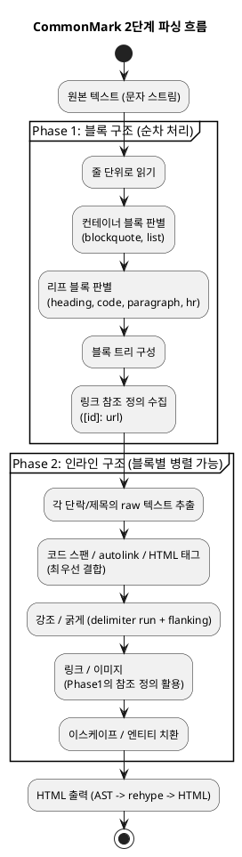

# 마크다운 에디터 구현 스펙 (CommonMark 0.31.2)

> **목적**: 마크다운 에디터의 **툴바 기능 1개 = 스펙 1개** 단위로 정리한 구현 레퍼런스.
> 각 기능마다 `문법 → HTML 결과물 → 에디터 동작 방식 → 핵심 규칙`을 표준 출력과 함께 제공한다.
>
> **기준 스펙**: CommonMark Spec **Version 0.31.2 (2024-01-28)** — 현재 최신 버전 (2026-06 기준 0.32 없음)
> **대상 프로젝트**: markflow (remark/rehype 11 + CodeMirror 6)
> **표기 규칙**: `→`는 탭(tab) 문자. HTML 결과는 CommonMark 공식 conformance 예제 출력과 동일.

---

## 0. 결론 — 툴바 기능 매핑 (한눈에 보기)

### CommonMark 0.31.2 코어 (19개 기능)

| # | 그룹 | 라벨(tooltip) | 아이콘 | 삽입 문법 | 동작 | 액션 fn |
|---|------|--------------|--------|----------|------|---------|
| 1 | 제목 | `Heading 1` | Heading1 | `# ` | 줄 접두 | `prefixLines` |
| 2 | 제목 | `Heading 2` | Heading2 | `## ` | 줄 접두 | `prefixLines` |
| 3 | 제목 | `Heading 3` | Heading3 | `### ` | 줄 접두 | `prefixLines` |
| 4 | 인라인 | `Bold` | Bold | `**bold text**` | 선택 감싸기 | `wrapSelection('**','**')` |
| 5 | 인라인 | `Italic` | Italic | `*italic text*` | 선택 감싸기 | `wrapSelection('*','*')` |
| 6 | 인라인 | `Strikethrough` | Strikethrough | `~~strikethrough~~` | 선택 감싸기 | `wrapSelection('~~','~~')` |
| 7 | 인라인 | `Inline code` | Code | `` `code` `` | 선택 감싸기 | `wrapSelection('`','`')` |
| 8 | 목록 | `Unordered list` | List | `- ` | 줄 접두 | `prefixLines` |
| 9 | 목록 | `Ordered list` | ListOrdered | `1. ` (줄마다 증가) | 줄 접두 | `prefixLines((n)=>n+'. ')` |
| 10 | 목록 | `Task list` | ListChecks | `- [ ] ` | 줄 접두 | `prefixLines` |
| 11 | 블록 | `Blockquote` | Quote | `> ` | 줄 접두 | `prefixLines` |
| 12 | 블록 | `Code block` | SquareCode | ` ```\nyour code here\n``` ` | 블록 삽입 | `insertBlock('```','```')` |
| 13 | 블록 | `Horizontal rule` | Minus | `\n---\n` | 텍스트 삽입 | `insertText` |
| 14 | 삽입 | `Link` | Link | `[link text](https://)` | 선택 감싸기 | `wrapSelection('[','](https://)')` |
| 15 | 삽입 | `Image (URL)` | Image | `` | 텍스트 삽입 | `insertText` |
| 16 | 삽입 | `Table` | Table | `\| Column 1 \| Column 2 \| Column 3 \|`<br>`\| --- \| --- \| --- \|`<br>`\| Cell \| Cell \| Cell \|` | 텍스트 삽입 | `insertText` |

### GFM 확장 (CommonMark 코어 ❌ — 별도 파서 필요, §7 참조)

| # | 에디터 기능 | 문법 | HTML 태그 | 비고 |
|---|------------|------|-----------|------|
| G1 | 취소선 | `~~텍스트~~` | `<del>` | remark-gfm 필요 |
| G2 | 표 | `\| a \| b \|` | `<table>` | remark-gfm 필요 |
| G3 | 작업 목록 | `[ ]` / `[x]` | `<input type=checkbox>` | remark-gfm 필요 |

> ⚠️ **핵심 주의**: 표·취소선·체크박스·각주는 **CommonMark 0.31.2에 존재하지 않는다.** GitHub Flavored Markdown(GFM) 확장이다. markflow는 `remark-gfm` 플러그인을 이미 사용하므로 동작하지만, "CommonMark 스펙" 문서에는 코어와 확장을 명확히 분리해 표기해야 한다.

---

## 1. 문서 사용법

본 문서는 에디터 구현 시 다음과 같이 활용한다.

1. **툴바 버튼 설계**: §0 매핑 표 → 각 버튼이 삽입할 문법과 동작 타입(선택 감싸기/줄 접두/블록 삽입) 결정.
2. **렌더링 검증**: 각 기능의 `HTML 결과물`을 단위 테스트의 기대값(expected output)으로 사용. CommonMark 공식 예제 출력이라 그대로 conformance 테스트가 된다.
3. **토글 로직 구현**: §3·§4의 `동작 방식`을 참조해 "이미 적용된 서식 해제" 로직 작성.
4. **엣지 케이스 방어**: 각 기능의 `핵심 규칙` 표가 파서/입력기가 처리해야 할 경계 조건.

---

## 2. 에디터 동작 분류 (4가지 액션 타입)

툴바 버튼은 실제로 4가지 텍스트 조작 패턴 중 하나로 귀결된다.

| 액션 타입 | 설명 | 해당 기능 | 토글 가능 |
|----------|------|----------|----------|
| **선택 감싸기** (wrap) | 선택 영역 앞뒤에 구분자 삽입. 선택 없으면 커서 위치에 빈 쌍 삽입 후 가운데 커서 | 굵게, 기울임, 코드, 취소선 | O |
| **줄 접두** (line prefix) | 현재 줄(또는 선택된 여러 줄) 맨 앞에 접두 문자열 삽입 | 제목, 인용, 목록 | O |
| **블록 삽입** (block) | 빈 줄을 확보하고 멀티라인 구조 삽입 | 코드 블록, 구분선, 표 | △ |
| **입력 다이얼로그** (dialog) | URL·대체텍스트 등 추가 입력을 받아 조립 | 링크, 이미지 | X |

> **선택 감싸기 토글 규칙(권장)**: 선택 영역이 이미 `**...**`로 감싸여 있으면 구분자를 제거(off), 아니면 추가(on). 이중 적용(`****텍스트****`)을 방지해야 한다.

---

## 3. 블록 단위 기능 (Block-level Leaf/Container Blocks)

### 3.1 ATX 제목 (Heading)

- **분류**: Leaf block | **동작**: 줄 접두 | **토글**: O
- **스펙**: §4.2 ATX headings (Example 62)

**문법**

```text
# foo
## foo
### foo
#### foo
##### foo
###### foo
```

**HTML 결과물**

```html
<h1>foo</h1>
<h2>foo</h2>
<h3>foo</h3>
<h4>foo</h4>
<h5>foo</h5>
<h6>foo</h6>
```

**핵심 규칙**

| 규칙 | 내용 | 예 |
|------|------|----|
| 레벨 | `#` 1–6개 = h1–h6. 7개 이상은 제목 아님 | `####### foo` → `<p>####### foo</p>` |
| 공백 필수 | `#`와 내용 사이 공백/탭 1개 이상 필요 | `#5 bolt` → 제목 아님 |
| 들여쓰기 | 앞 공백 0–3칸 허용, 4칸은 코드 블록 | `   # foo`=제목 |
| 닫는 `#` | 선택. `## foo ##` 가능, 내용에 미포함 | `## foo ##` → `<h2>foo</h2>` |
| 빈 제목 | 허용 | `##` → `<h2></h2>` |
| 인라인 파싱 | 내용은 인라인으로 파싱됨 | `# foo *bar*` → `<h1>foo <em>bar</em></h1>` |

**에디터 동작**: 줄 맨 앞에 `# ` 삽입. 재클릭 시 레벨 순환(h1→h2→…→h6→해제) 또는 레벨 고정 버튼 분리.

---

### 3.2 Setext 제목 (밑줄형 제목)

- **분류**: Leaf block | **동작**: 다음 줄에 밑줄 추가 | **토글**: △
- **스펙**: §4.3 Setext headings (Example 80, 83)

**문법**

```text
Foo
===

Foo
---
```

**HTML 결과물**

```html
<h1>Foo</h1>
<h2>Foo</h2>
```

**핵심 규칙**

| 규칙 | 내용 |
|------|------|
| 레벨 한계 | `=`=h1, `-`=h2 **두 단계만** 지원 |
| 밑줄 길이 | 1개 이상이면 됨 (`Foo` + `=` 가능) |
| 단락 중단 불가 | 앞 단락과 빈 줄 없으면 단락에 합쳐짐 |
| 우선순위 | `---`이 thematic break와 겹치면 setext 우선 |

**에디터 동작**: ATX 방식(`#`)을 기본 권장. Setext는 h1/h2만 가능하므로 보조 옵션으로 제공.

---

### 3.3 인용구 (Block Quote)

- **분류**: Container block | **동작**: 줄 접두 | **토글**: O
- **스펙**: §5.1 Block quotes (Example 228)

**문법**

```text
> # Foo
> bar
> baz
```

**HTML 결과물**

```html
<blockquote>
<h1>Foo</h1>
<p>bar
baz</p>
</blockquote>
```

**핵심 규칙**

| 규칙 | 내용 |
|------|------|
| 마커 | `>` + 공백 1개(공백 생략 가능) |
| 들여쓰기 | 앞 공백 0–3칸 허용, 4칸은 코드 블록 |
| 중첩 | `> > >` 다중 인용 가능 |
| 게으른 연속(laziness) | 단락 연속 줄은 `>` 생략 가능 |
| 컨테이너 | 내부에 모든 블록(제목·목록·코드) 포함 가능 |

**에디터 동작**: 선택된 모든 줄 앞에 `> ` 삽입. 토글 시 `> ` 제거.

---

### 3.4 순서 없는 목록 (Bullet List)

- **분류**: Container block | **동작**: 줄 접두 | **토글**: O
- **스펙**: §5.2/§5.3 List items / Lists (Example 301)

**문법**

```text
- foo
- bar
- baz
```

**HTML 결과물**

```html
<ul>
<li>foo</li>
<li>bar</li>
<li>baz</li>
</ul>
```

**핵심 규칙**

| 규칙 | 내용 |
|------|------|
| 마커 종류 | `-`, `+`, `*` 모두 가능 |
| 마커 변경 = 새 목록 | `- foo` 다음 `+ baz`는 별개 `<ul>` 2개 |
| 공백 필수 | 마커와 내용 사이 공백/탭 1개 이상 |
| 중첩 | 마커 너비만큼 들여쓰기(보통 2칸) |
| tight/loose | 항목 사이 빈 줄 있으면 loose → `<p>` 감쌈 |

**에디터 동작**: 각 줄 앞에 `- ` 삽입. 엔터 시 자동으로 다음 `- ` 생성, 빈 항목에서 엔터 시 목록 종료.

---

### 3.5 순서 있는 목록 (Ordered List)

- **분류**: Container block | **동작**: 줄 접두 | **토글**: O
- **스펙**: §5.2/§5.3 (Example 302, 265)

**문법**

```text
1. foo
2. bar
3. baz
```

**HTML 결과물**

```html
<ol>
<li>foo</li>
<li>bar</li>
<li>baz</li>
</ol>
```

**핵심 규칙**

| 규칙 | 내용 | 예 |
|------|------|----|
| 마커 | `숫자.` 또는 `숫자)` | `1.` `1)` 모두 가능 |
| 시작 번호 | 첫 항목 번호로 결정 | `5. a` → `<ol start="5">` |
| 자릿수 한계 | 1–9자리(최대 999999999) | `1234567890.`은 목록 아님 |
| 단락 중단 | `1`로 시작할 때만 단락 중단 가능 | 하드랩 오인식 방지 |
| 구분자 변경 = 새 목록 | `.`→`)` 전환 시 별개 목록 |

**에디터 동작**: `1. ` 삽입 후 엔터 시 번호 자동 증가. 렌더러는 첫 번호만 보고 `start` 결정(이후 번호 무시).

---

### 3.6 펜스 코드 블록 (Fenced Code Block)

- **분류**: Leaf block | **동작**: 블록 삽입 | **토글**: △
- **스펙**: §4.5 Fenced code blocks (Example 142)

**문법** (외곽을 4-backtick으로 표기)

````text
```ruby
def foo(x)
  return 3
end
```
````

**HTML 결과물**

```html
<pre><code class="language-ruby">def foo(x)
  return 3
end
</code></pre>
```

**핵심 규칙**

| 규칙 | 내용 |
|------|------|
| 펜스 문자 | 백틱 ``` ``` ``` 또는 물결 `~~~` 3개 이상(혼용 불가) |
| info string | 펜스 뒤 첫 단어 = 언어 → `class="language-xxx"` |
| 백틱 제한 | 백틱 펜스의 info string엔 백틱 사용 불가 |
| 닫는 펜스 | 여는 펜스와 같은 문자, 같거나 더 긴 길이 |
| 내용 | 리터럴(인라인 파싱 안 함) |
| 단락 중단 | 가능, 앞뒤 빈 줄 불필요 |

**에디터 동작**: 선택 영역을 ``` ```\n선택\n``` ```으로 감쌈. 언어 선택 드롭다운 제공 권장.

---

### 3.7 들여쓰기 코드 블록 (Indented Code Block)

- **분류**: Leaf block | **동작**: 줄 접두(4칸) | **토글**: △
- **스펙**: §4.4 Indented code blocks (Example 107)

**문법**

```text
    a simple
      indented code block
```

**HTML 결과물**

```html
<pre><code>a simple
  indented code block
</code></pre>
```

**핵심 규칙**

| 규칙 | 내용 |
|------|------|
| 들여쓰기 | 각 줄 4칸 이상 공백 |
| info string | 없음(언어 지정 불가) |
| 단락 중단 불가 | 앞 단락과 빈 줄 필요 |
| 우선순위 | 목록 항목 해석이 들여쓰기 코드보다 우선 |

**에디터 동작**: 펜스 코드 블록(§3.6)을 기본 권장. 들여쓰기 방식은 언어 지정이 안 되므로 비권장.

---

### 3.8 구분선 (Thematic Break)

- **분류**: Leaf block | **동작**: 블록 삽입 | **토글**: X
- **스펙**: §4.1 Thematic breaks (Example 43)

**문법**

```text
***
---
___
```

**HTML 결과물**

```html
<hr />
<hr />
<hr />
```

**핵심 규칙**

| 규칙 | 내용 |
|------|------|
| 문자 | `-`, `_`, `*` 중 동일 문자 3개 이상 |
| 공백 | 문자 사이/끝 공백·탭 허용 (`- - -` 가능) |
| 혼용 불가 | `*-*`는 구분선 아님 |
| 들여쓰기 | 0–3칸 허용 |
| setext 충돌 | `---`이 앞 단락의 밑줄이 될 수 있으면 setext h2 우선 |

**에디터 동작**: 빈 줄 확보 후 `\n---\n` 삽입. `---` 사용 시 앞에 텍스트가 있으면 setext 제목으로 오인되므로 앞뒤 빈 줄 보장.

---

### 3.9 단락 (Paragraph)

- **분류**: Leaf block | **동작**: 기본 | **토글**: X
- **스펙**: §4.8 Paragraphs (Example 219)

**문법**

```text
aaa

bbb
```

**HTML 결과물**

```html
<p>aaa</p>
<p>bbb</p>
```

**핵심 규칙**: 다른 블록으로 해석되지 않는 비어있지 않은 연속 줄. 여러 줄 가능(빈 줄 없을 때). 앞뒤 공백은 제거됨.

---

## 4. 인라인 단위 기능 (Inlines)

### 4.1 굵게 (Strong Emphasis)

- **분류**: Inline | **동작**: 선택 감싸기 | **토글**: O
- **스펙**: §6.2 Emphasis and strong emphasis (Example 378)

| 항목 | 값 |
|------|----|
| 문법 | `**foo bar**` 또는 `__foo bar__` |
| HTML | `<p><strong>foo bar</strong></p>` |

**핵심 규칙**

| 규칙 | 내용 |
|------|------|
| 구분자 | `**` 또는 `__` |
| 단어 내 적용 | `**`는 단어 중간 가능(`foo**bar**`), `__`는 불가(`foo__bar__`는 그대로) |
| 빈 강조 불가 | `****`는 강조 아님 |
| flanking 규칙 | 여는 `**` 뒤에 공백 오면 강조 아님 |

**에디터 동작(권장)**: 선택을 `**...**`로 감싸기. 단어 내 적용 안정성을 위해 **`*`(별표) 계열 사용** 권장(`_` 계열은 단어 내 미동작).

---

### 4.2 기울임 (Emphasis)

- **분류**: Inline | **동작**: 선택 감싸기 | **토글**: O
- **스펙**: §6.2 (Example 350)

| 항목 | 값 |
|------|----|
| 문법 | `*foo bar*` 또는 `_foo bar_` |
| HTML | `<p><em>foo bar</em></p>` |

**핵심 규칙**

| 규칙 | 내용 |
|------|------|
| 구분자 | `*` 또는 `_` |
| 단어 내 적용 | `*`만 가능(`foo*bar*`→`foo<em>bar</em>`), `_`는 불가 |
| 빈 강조 불가 | `**`(빈 쌍)는 강조 아님 |

**에디터 동작**: 선택을 `*...*`로 감싸기. 굵게(`**`)와 충돌 방지 토글 로직 필요.

---

### 4.3 굵은 기울임 (Strong + Emphasis)

- **분류**: Inline | **동작**: 선택 감싸기 | **토글**: O
- **스펙**: §6.2 Rule 14 (Example 467)

| 항목 | 값 |
|------|----|
| 문법 | `***foo***` |
| HTML | `<p><em><strong>foo</strong></em></p>` |

> **주의**: 중첩 순서가 `<em><strong>`(em 바깥). Rule 14에 의해 `<strong><em>`보다 우선.

---

### 4.4 인라인 코드 (Code Span)

- **분류**: Inline | **동작**: 선택 감싸기 | **토글**: O
- **스펙**: §6.1 Code spans (Example 328, 329)

| 항목 | 값 |
|------|----|
| 문법 | `` `foo` `` |
| HTML | `<p><code>foo</code></p>` |

**핵심 규칙**

| 규칙 | 내용 | 예 |
|------|------|----|
| 구분자 | 백틱 N개로 열고 같은 N개로 닫음 | `` ``foo`bar`` `` → `<code>foo`bar</code>` |
| 백틱 포함 | 내용에 백틱 있으면 더 긴 백틱으로 감쌈 | |
| 공백 제거 | 양끝 공백 1개씩 제거(양쪽 모두 있을 때) | `` ` `` foo `` ` `` → `<code>foo</code>` |
| 이스케이프 안 됨 | `\`는 리터럴 | `` `foo\`bar` `` → `<code>foo\</code>bar\`` |
| 우선순위 | 코드 스팬이 강조·링크보다 우선 | |

**에디터 동작**: 선택을 `` ` ``로 감싸기. 선택 내용에 백틱이 있으면 백틱 개수를 자동 증가시켜 충돌 방지.

---

### 4.5 인라인 링크 (Inline Link)

- **분류**: Inline | **동작**: 입력 다이얼로그 | **토글**: X
- **스펙**: §6.3 Links (Example 482, 483)

| 항목 | 값 |
|------|----|
| 문법(제목 포함) | `[link](/uri "title")` |
| HTML | `<p><a href="/uri" title="title">link</a></p>` |
| 문법(제목 생략) | `[link](/uri)` |
| HTML | `<p><a href="/uri">link</a></p>` |

**핵심 규칙**

| 규칙 | 내용 |
|------|------|
| 구성 | `[텍스트](대상 "제목")` — 제목 선택 |
| 중첩 금지 | 링크 안에 링크 불가 |
| 대상 형식 | `<...>`로 감싸면 공백 포함 가능 |
| 우선순위 | 코드 스팬·autolink·HTML 태그가 `[ ]`보다 강하게 결합 |
| 강조와 결합 | `[ ]`가 강조 마커보다 강하게 결합(`*[foo*](url)`는 링크) |

**에디터 동작**: 선택 텍스트를 `[선택]()`로 만들고 URL 입력 받아 괄호 안 채움. URL·제목 다이얼로그 제공.

---

### 4.6 참조 링크 (Reference Link)

- **분류**: Inline + Link reference definition | **동작**: 입력 다이얼로그 | **토글**: X
- **스펙**: §4.7 Link reference definitions (Example 192)

**문법**

```text
[foo]

[foo]: /url "title"
```

**HTML 결과물**

```html
<p><a href="/url" title="title">foo</a></p>
```

**핵심 규칙**

| 규칙 | 내용 |
|------|------|
| 정의 위치 | 링크 앞/뒤 어디든 가능, 문서 전체에 영향 |
| 대소문자 | 라벨 매칭은 대소문자 무시 (`[FOO]`=`[foo]`) |
| 중복 정의 | 첫 정의 우선 |
| 컨테이너 내 정의 | 인용·목록 안에 정의해도 문서 전역 적용 |

**에디터 동작**: 반복 사용 URL에 유용. 정의를 문서 하단에 자동 수집/삽입하는 기능 권장.

---

### 4.7 이미지 (Image)

- **분류**: Inline | **동작**: 입력 다이얼로그 | **토글**: X
- **스펙**: §6.4 Images

| 항목 | 값 |
|------|----|
| 문법(제목 포함) | `` |
| HTML | `<p></p>` |
| 문법(제목 생략) | `` |
| HTML | `<p></p>` |

**핵심 규칙**

| 규칙 | 내용 |
|------|------|
| 구문 | 링크와 동일하되 앞에 `!` |
| alt 텍스트 | `[ ]` 안 내용이 `alt` 속성. 내부 마크업은 평문화됨 |
| 참조형 | `![foo][id]` + `[id]: /url` 가능 |

**에디터 동작**: 파일 업로드/URL 입력 → `` 조립. alt 텍스트 입력 권장(접근성).

---

### 4.8 자동 링크 (Autolink)

- **분류**: Inline | **동작**: 선택 감싸기 | **토글**: X
- **스펙**: §6.5 Autolinks

| 항목 | 값 |
|------|----|
| URI 문법 | `<https://example.com>` |
| HTML | `<p><a href="https://example.com">https://example.com</a></p>` |
| 이메일 문법 | `<foo@bar.example.com>` |
| HTML | `<p><a href="mailto:foo@bar.example.com">foo@bar.example.com</a></p>` |

**핵심 규칙**

| 규칙 | 내용 |
|------|------|
| URI | `<스킴:...>` — 스킴은 2–32자, 영문 시작 |
| 이메일 | `<주소>` → 자동으로 `mailto:` 부착 |
| 공백 불가 | `< >` 안에 공백 있으면 autolink 아님 |

> **주의**: 꺾쇠 없는 평문 URL(`www.example.com`, `https://...`) 자동 링크화는 **GFM 확장(자동 링크 리터럴, §7.4)**이며 CommonMark 코어가 아니다.

---

### 4.9 강제 줄바꿈 (Hard Line Break)

- **분류**: Inline | **동작**: 줄 끝 삽입 | **토글**: X
- **스펙**: §2.4 / §6.7 Hard line breaks (Example 16)

**문법** (줄 끝 공백 2개 = `··`, 또는 백슬래시)

```text
foo··
bar

foo\
bar
```

**HTML 결과물**

```html
<p>foo<br />
bar</p>
```

**핵심 규칙**

| 규칙 | 내용 |
|------|------|
| 방법 1 | 줄 끝 공백 2개 이상 + 줄바꿈 |
| 방법 2 | 줄 끝 백슬래시 `\` + 줄바꿈 |
| 단순 줄바꿈 | 공백 없는 줄바꿈 = soft break(`\n`, `<br>` 아님) |
| 제목 내 무효 | setext/단락 끝 공백은 strip되어 hard break 안 됨 |

**에디터 동작**: 공백 2개는 보이지 않아 혼란 → **백슬래시 방식 권장**. 또는 에디터가 trailing space를 시각 표시.

---

## 5. 이스케이프 & 특수 처리

### 5.1 백슬래시 이스케이프 (Backslash Escape)

- **스펙**: §2.4 (Example 12, 14)

| 항목 | 값 |
|------|----|
| 문법 | `\*not emphasized*` |
| HTML | `<p>*not emphasized*</p>` |

**핵심 규칙**

| 규칙 | 내용 |
|------|------|
| 대상 | ASCII 구두점 문자만 이스케이프 가능 |
| 비대상 | 그 외 문자 앞 `\`는 리터럴 백슬래시 |
| 무효 영역 | 코드 블록·코드 스팬·autolink·원시 HTML 내부에선 동작 안 함 |
| 유효 영역 | URL·링크 제목·info string 등에선 동작 |

---

### 5.2 엔티티 / 숫자 문자 참조 (Entity & Numeric Reference)

- **스펙**: §2.5 (Example 25, 26, 27)

| 항목 | 값 |
|------|----|
| 명명 엔티티 | `&amp; &copy; &AElig;` → `& © Æ` |
| 10진수 | `&#35;` → `#` |
| 16진수 | `&#X22;` → `"` |

**핵심 규칙**

| 규칙 | 내용 |
|------|------|
| 세미콜론 필수 | `&copy`(세미콜론 없음)는 `&amp;copy`로 출력 |
| 구조 문자 대체 불가 | `&#42;`는 `*`로 렌더되지만 강조 마커로는 작동 안 함 |
| 무효 영역 | 코드 블록·코드 스팬 내부에선 리터럴 텍스트 |
| 무효 코드포인트 | `U+0000` → `U+FFFD`로 치환 |

---

### 5.3 원시 HTML (Raw HTML / HTML Block)

- **스펙**: §4.6 HTML blocks / §6.6 Raw HTML (Example 148, 168)

| 항목 | 값 |
|------|----|
| 인라인 HTML | `<del>*foo*</del>` → `<p><del><em>foo</em></del></p>` |
| HTML 블록 | 줄 시작 `<div>` 등 7종 시작 조건 |

**핵심 규칙**

| 규칙 | 내용 |
|------|------|
| 7가지 블록 유형 | `<pre>/<script>/<style>/<textarea>`, 주석, PI, 선언, CDATA, 블록 태그, 일반 태그 |
| 블록 종료 | 유형별 종료 조건(빈 줄 또는 매칭 종료 태그) |
| markdown 삽입 | HTML 블록 사이를 빈 줄로 나누면 내부를 markdown으로 파싱 |
| 보안 | 사용자 입력 렌더 시 **반드시 sanitize**(rehype-sanitize 등) |

> ⚠️ **markflow 보안 노트**: SaaS이므로 원시 HTML을 그대로 렌더하면 XSS 위험. `rehype-sanitize` 또는 허용 태그 화이트리스트 필수.

---

## 6. 파싱 전략 (2단계) — 렌더러 구현용

CommonMark은 **블록 구조 → 인라인 구조** 2단계로 파싱한다(§3.1 Precedence). 블록 구조가 항상 인라인보다 우선이며, 인라인 파싱은 블록별 병렬화 가능하다.

> 아래 PlantUML 코드를 복사해 이미지로 변환 사용.



**구현 시사점**

| 단계 | 에디터/렌더러에 주는 의미 |
|------|--------------------------|
| 블록 우선 | 툴바의 "줄 접두" 액션은 블록 단계에 영향 → 줄 전체 단위로 처리 |
| 인라인 병렬 | "선택 감싸기" 액션은 인라인이라 블록 경계를 넘지 않도록 주의 |
| 참조 정의 | 참조 링크는 1단계에서 수집되므로 위치 무관 → 에디터가 하단 자동 수집 가능 |

---

## 7. GFM 확장 (⚠️ CommonMark 0.31.2 코어 아님)

아래 기능은 **CommonMark 스펙에 존재하지 않으며** GitHub Flavored Markdown 확장이다. markflow는 `remark-gfm`을 사용하므로 동작한다. "스펙" 문서에서는 반드시 코어와 분리 표기한다.

### 7.1 취소선 (Strikethrough)

| 항목 | 값 |
|------|----|
| 문법 | `~~foo~~` |
| HTML | `<del>foo</del>` |
| 동작 | 선택 감싸기 (토글 O) |
| 출처 | GFM Spec §6.5 Strikethrough |

### 7.2 표 (Table)

**문법**

```text
| 헤더1 | 헤더2 |
| --- | --- |
| a | b |
```

**HTML 결과물**

```html
<table>
<thead>
<tr><th>헤더1</th><th>헤더2</th></tr>
</thead>
<tbody>
<tr><td>a</td><td>b</td></tr>
</tbody>
</table>
```

| 규칙 | 내용 |
|------|------|
| 정렬 | `:---`(좌) `:---:`(중) `---:`(우) |
| 동작 | 블록 삽입 (행/열 추가 UI 권장) |
| 출처 | GFM Spec §4.10 Tables |

### 7.3 작업 목록 / 체크박스 (Task List)

| 항목 | 값 |
|------|----|
| 문법(미완료) | `- [ ] foo` |
| 문법(완료) | `- [x] foo` |
| HTML(미완료) | `<li><input type="checkbox" disabled> foo</li>` |
| HTML(완료) | `<li><input type="checkbox" checked disabled> foo</li>` |
| 출처 | GFM Spec §5.3 Task list items |

### 7.4 자동 링크 리터럴 (Autolink Literal)

| 항목 | 값 |
|------|----|
| 문법 | `www.example.com` / `https://example.com` (꺾쇠 불필요) |
| HTML | `<a href="http://www.example.com">www.example.com</a>` |
| 출처 | GFM Spec §6.9 Autolinks (extension) |

---

## 8. markflow 구현 노트 (remark/rehype 11 + CodeMirror 6)

| 항목 | 권장 사항 |
|------|----------|
| 파서 | `remark-parse` (CommonMark 코어) + `remark-gfm` (§7 확장) |
| 렌더 | `remark-rehype` → `rehype-sanitize` → `rehype-stringify` |
| 보안 | 원시 HTML(§5.3) 때문에 `rehype-sanitize` 필수 (XSS 방어) |
| 수식 | `remark-math` + `rehype-katex` (KaTeX, 스택에 포함됨) |
| 코드 하이라이트 | `rehype-highlight` 또는 Shiki (info string의 `language-*` 활용) |
| 에디터 | CodeMirror 6 — 툴바 액션은 §2의 4가지 타입으로 `dispatch` 트랜잭션 구현 |
| 토글 구현 | 선택 영역 양끝 구분자 존재 여부 검사 후 추가/제거 |
| 테스트 | 각 기능의 `HTML 결과물`을 Vitest 기대값으로 사용 → conformance 회귀 테스트 |

**툴바 액션 구현 매핑 예시(개념)**

| 버튼 | CodeMirror 처리 |
|------|----------------|
| 굵게 | 선택 범위를 `**`로 감싸는 changeset dispatch |
| 제목 | 현재 줄 from 위치에 `# ` 삽입 |
| 코드블록 | 선택 위 아래로 ``` ``` ``` 줄 삽입 |
| 링크 | 다이얼로그 → `[선택](url)` 치환 |

---

## 9. 출처 (Sources)

| 출처 | URL | 확인일 |
|------|-----|--------|
| CommonMark Spec 0.31.2 (본문) | https://spec.commonmark.org/0.31.2/ | 2026-06-25 |
| CommonMark 버전 목록(최신성 확인) | https://spec.commonmark.org/ | 2026-06-25 |
| 0.31.2 릴리스 공지 | https://talk.commonmark.org/t/ann-commonmark-0-31-2/4591 | 2026-06-25 |
| CommonMark changelog | https://spec.commonmark.org/changelog.txt | 2026-06-25 |
| 레퍼런스 구현(cmark) | https://github.com/commonmark/commonmark-spec | 2026-06-25 |
| GFM Spec (확장 §7) | https://github.github.com/gfm/ | 일반지식(미재검증) |

> §7 GFM 문법/HTML은 일반 지식 기반이며, 정확한 conformance 출력은 GFM Spec 원문 재확인 권장(녹화 시점 검증 항목).

---

## 10. 할루시네이션 검증표

| # | 주장 | 검증 상태 | 근거 |
|---|------|----------|------|
| 1 | 최신 CommonMark 버전 = 0.31.2 (2024-01-28) | ✅ 확인 | spec.commonmark.org 버전 목록, 0.32 없음 |
| 2 | `# foo`→`<h1>foo</h1>`, 7개는 제목 아님 | ✅ 확인 | Spec Example 62, 63 |
| 3 | `**foo**`→`<strong>`, `*foo*`→`<em>` | ✅ 확인 | Spec Example 378, 350 |
| 4 | `***foo***`→`<em><strong>foo</strong></em>` (em 바깥) | ✅ 확인 | Spec Example 467, Rule 14 |
| 5 | 펜스 코드 `class="language-ruby"` | ✅ 확인 | Spec Example 142 |
| 6 | `_` 단어 내 강조 불가, `*` 가능 | ✅ 확인 | Spec Example 355, 360 |
| 7 | hard break = 줄 끝 공백 2개 또는 `\` | ✅ 확인 | Spec Example 16, §6.7 |
| 8 | 인라인 링크 `[link](/uri "title")` 출력 | ✅ 확인 | Spec Example 482 |
| 9 | 코드 스팬 양끝 공백 1개 제거 규칙 | ✅ 확인 | Spec Example 329, 330 |
| 10 | 순서 목록 자릿수 최대 9, `start` 속성 | ✅ 확인 | Spec Example 265, 266 |
| 11 | 파싱 = 블록 우선 → 인라인 2단계 | ✅ 확인 | Spec §3.1 Precedence |
| 12 | 표·취소선·체크박스 = GFM 확장(코어 아님) | ✅ 확인 | spec.commonmark.org 목차(6.4 Images까지가 inline 마지막), GFM은 별도 |
| 13 | 이미지 `` 출력 | ⚠️ 일반지식 | §6.4 직접 예제 미인용(본문 fetch 절단). 표준 출력이나 녹화 시 재확인 |
| 14 | autolink 이메일 `mailto:` 부착 | ⚠️ 일반지식 | §6.5 직접 예제 미인용. 표준 동작이나 재확인 권장 |
| 15 | GFM 취소선 `<del>`, 표/체크박스 HTML | ⚠️ 일반지식 | GFM Spec 원문 미재검증 — 녹화 시점 확인 |

**재검증 권장 항목(녹화 시점)**: #13 이미지 HTML, #14 autolink 이메일, #15 GFM 출력 → CommonMark dingus(https://spec.commonmark.org/dingus/) 및 GFM Spec으로 최종 확인.
